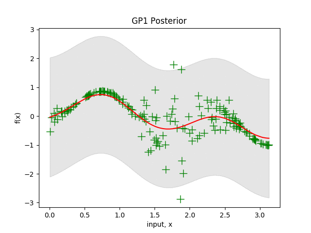

# Heteroscedastic-BO

[](LICENSE)

Heteroscedastic Bayesian Optimisation uisng the most likely heteroscedatic Gaussian Process as the surrogate model.
Experiment scripts may be found in the BayesOpt/bayesopt_experiments directory.

<p align="center">
  
</p>

## Install

We recommend using a conda environment

```
conda create -n hetbo python==3.7
conda activate hetbo
conda install matplotlib numpy pytest scikit-learn pandas
conda install scipy==1.1.0
conda install -c conda-forge rdkit
```

## Usage

To reproduce the experiments in the paper using the default values of the hyperparameters

```
python toy_sin_noise.py
python toy_branin_hoo.py
python toy_soil.py
python freesolv.py
python synthetic_func_experiments.py
python gamma_experiments.py
```

To experiment with different hyperparameter settings

```
python toy_sin_noise.py --penalty 1 --aleatoric_weight 1 
                        --random_trials 50 --bayes_opt_iters 5 
```

To adapt the algorithm to your own dataset follow the `toy_soil.py` template making use of the dataloder as
per your task requirements.

## Citing

If you find this code useful please consider citing the following paper https://arxiv.org/abs/1910.07779

```
@misc{griffiths2021achieving,
      title={Achieving Robustness to Aleatoric Uncertainty with Heteroscedastic Bayesian Optimisation}, 
      author={Ryan-Rhys Griffiths and Alexander A. Aldrick and Miguel Garcia-Ortegon and Vidhi R. Lalchand and Alpha A. Lee},
      year={2021},
      eprint={1910.07779},
      archivePrefix={arXiv},
      primaryClass={stat.ML}
}
```
